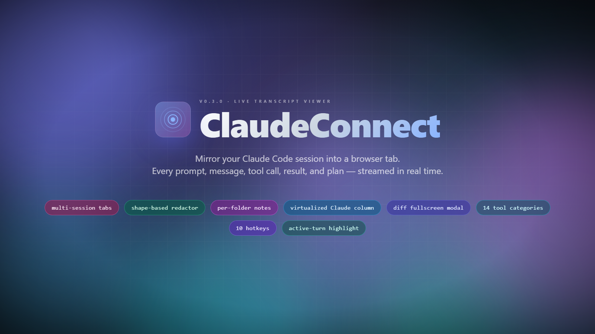
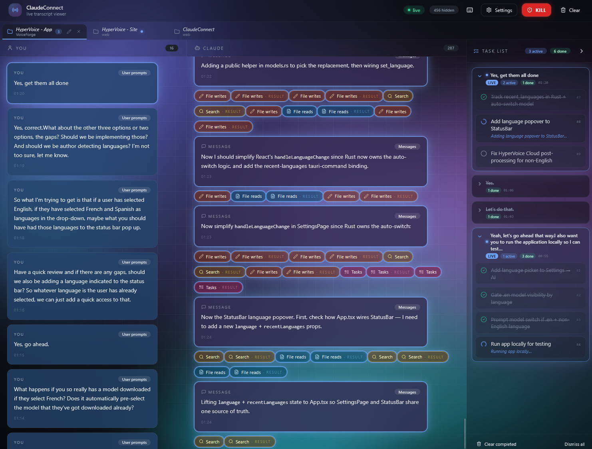
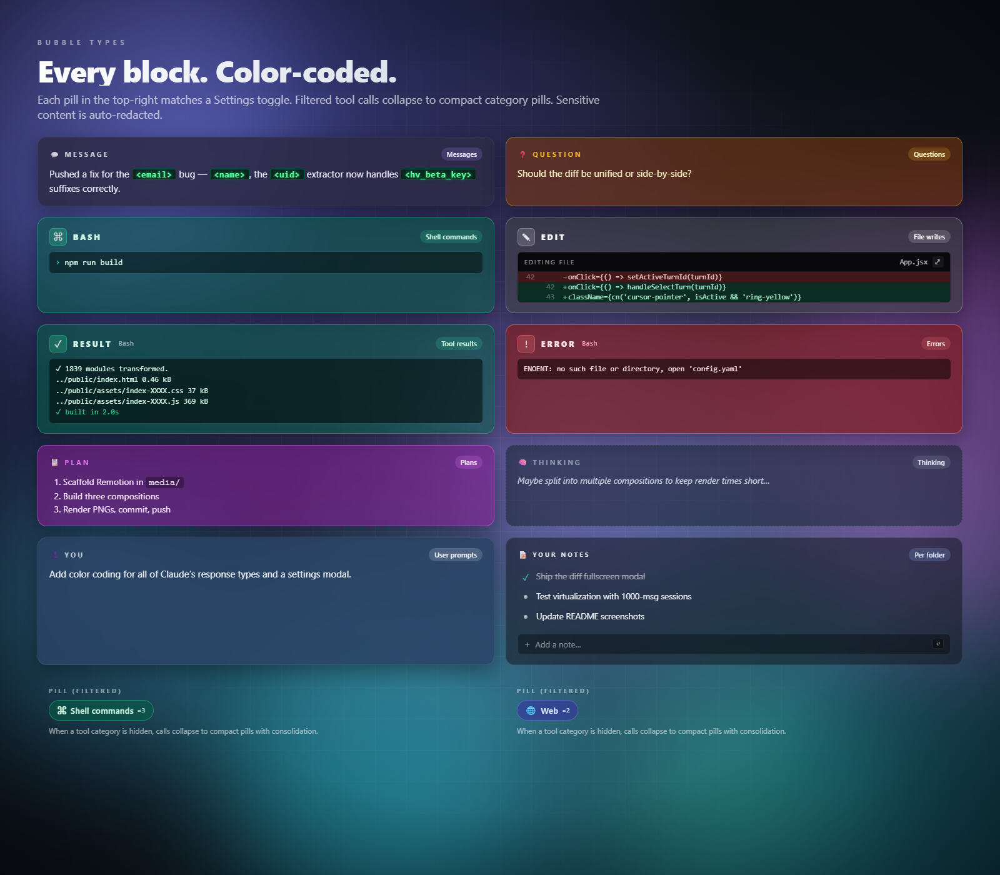

# ClaudeConnect

A live, real-time desktop viewer for your Claude Code sessions. Mirror your terminal conversation to a second monitor, share your screen while keeping your scrollback for yourself, or use it to keep a visual log of everything Claude does for you.

## Download

Grab the latest Windows installer / binary from the [**Releases page**](https://github.com/Adlistic/ClaudeConnectApp/releases/latest). Run it. That's it — no signup, no account, no cloud.

## What you get

A focused three-column desktop window that updates as Claude works:

- **You** (left) — every prompt you send, rendered as markdown. Click any prompt to jump the Claude column to the matching reply.
- **Claude** (middle) — every reply, tool call, plan, and result as it lands. Colour-coded by category. Code blocks render with syntax highlighting and a one-click Copy button. Diffs show inline (with a full-screen mode for big ones).
- **Tasks** (right) — live task tracker, grouped by the prompt that produced them. The in-flight group glows so you always know what Claude is working on right now. Plus a per-folder **personal notes** area where you can jot todos that travel with the project.

## Features

### Multi-session tabs

Run multiple Claude Code sessions in parallel? Each one gets its own tab at the top. Switch between them instantly — your scroll position and last-selected message are remembered per tab. Tabs glow when there's new activity, and a task-count badge shows you how busy each session is.

### Send prompts without leaving the app

A prompt bar at the bottom of the **You** column lets you send a new message into the active Claude Code session right from ClaudeConnect — useful when you want to drive a session from your couch with the visual feedback right in front of you.

### Personal notes per project

Every project folder gets its own scratch notes list at the bottom of the task panel. Add a note with Enter, click to mark it done, click the Play button to send it as a prompt. Notes survive across sessions and restarts; switch to a session in a different folder and you see that folder's notes.

### Bubble types

Every kind of thing Claude does has its own colour and icon — text replies, questions, tool calls (Shell, File reads, Writes, Search, Web, Tasks, Subagents, MCP integrations, and more), tool results, errors, plans, thinking blocks. Hide categories you don't want to see and they collapse into compact dots so you still know "something happened" without the noise.

### Search across everything

`Ctrl+F` opens a search panel that scans across every session in your history — not just the visible window. Click a result and the column jumps to that message instantly. Useful for "where did Claude touch that file three weeks ago?"

### Timeline & history

Scroll up in the Claude column and ClaudeConnect loads older messages on demand from your local database. Use the timeline calendar to jump straight to a specific day. There's no upper bound — sessions with 100,000+ messages work fine.

### Stream-safety guardrails

Built with live-streaming in mind:

- A red **KILL** button (or `K` / `Space` hotkey) instantly blurs the entire window if something unexpected lands on screen. Click anywhere to resume.
- A built-in PII / secret redactor scrubs emails, API keys, bearer tokens, signed Anthropic/OpenAI keys, Windows usernames, and a dozen other leak shapes before they're displayed. Always on — no toggle to accidentally flip mid-stream.
- Customise the redactor with your own patterns + deny-list for project-specific terms.

### Customisable appearance

Settings → Appearance lets you pick:

- **Background** — animated drifting blurred pixels (the default vibe), a flat solid colour (8 dark-tone presets + a custom HSL/opacity picker for any colour at any vibrancy), or no background at all.
- **Filtered tool display** — show filtered-out tool calls as compact dots, full pills, or hide them entirely.
- **Diff layout** — expand all diffs by default or keep them collapsed.

Filters, sessions, and storage retention live on their own tabs so you can find what you want without scrolling.

## Hotkeys

| Key | Action |
|-----|--------|
| `K` or `Space` | KILL / RESUME (blur the conversation) |
| `,` | Open / close Settings |
| `Ctrl+F` | Search across all sessions |
| `?` | Keyboard reference |
| `T` | Collapse the Task panel |
| `[` / `]` | Previous / next session tab |
| `1`–`9` | Jump to session tab N |
| `Esc` | Close any open modal |

## Requirements

- **Windows 10/11** (other platforms coming later — see source repo for build instructions)
- **Claude Code installed** and used at least once (so the local transcript directory exists)
- **Microsoft Edge WebView2 runtime** — preinstalled on Windows 11 and recent Windows 10; downloaded automatically by the installer if missing

## Source code

ClaudeConnect is open-source. The full source is at [Adlistic/ClaudeConnect](https://github.com/Adlistic/ClaudeConnect) if you want to build it yourself or see how it works.

## License

MIT.
